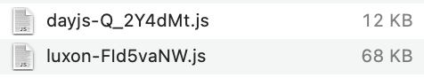
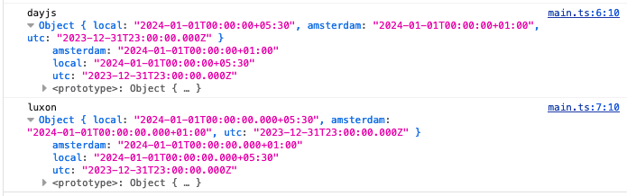

This compares the usage of setting a date in another timezone with dayjs & luxon.

The big difference between the two is that luxon is one big package. So it has a bigger size.  
For dayjs you will have to import the separate plugins and extend the base object with it.

You can discuss what you think about the syntax. Not sure which library has more features (when you include all dayjs plugins).

But you can't get around the file size difference.

  
> Clearly, for the intended usage (create date in another time zone), the dayjs chunk is much smaller

This is the output with my system time set to `Asia/Kolkata`:

  

Do it yourself by:
- Checking out the project
- `pnpm i`
- `pnpm dev` to play around
- `pnpm build` to create a dist folder with the bundles.
